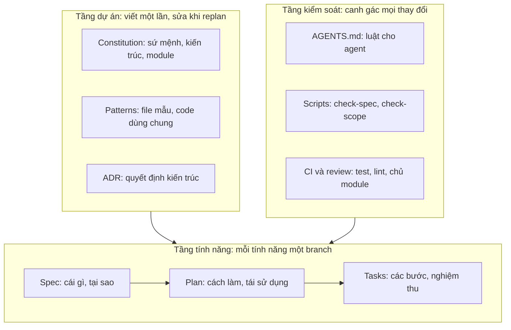
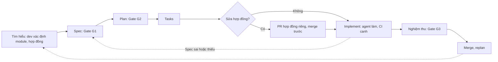

# Mô hình SDD Kit

## Cấu trúc ba tầng

| Tầng | Vai trò |
|---|---|
| Dự án | Đặt luật chơi, dẫn dắt mọi tính năng |
| Tính năng | Chuyển ý định thành code qua spec, plan, tasks |
| Kiểm soát | Chặn thay đổi lệch khỏi spec và quy ước |

## Quy trình một tính năng

| Bước | Người quyết định | Agent thực hiện |
|---|---|---|
| Tìm hiểu | Module chạm vào, có sửa hợp đồng không | Tra cứu nơi đang dùng |
| Spec | Phạm vi, quan hệ phụ thuộc, AC, duyệt G1 | Soạn nháp |
| Plan | Duyệt G2: tái sử dụng, pattern, file bị sửa | Đề xuất |
| Tasks | Kiểm tra mỗi task có AC và cách kiểm chứng | Chia bước |
| PR hợp đồng | Chủ module duyệt, ADR nếu lớn | Sửa hợp đồng và contract test |
| Implement | Review sau mỗi giai đoạn | Code, test, commit theo task |
| Nghiệm thu | Thử từng AC, duyệt G3 | Đối chiếu code với spec |
| Merge, replan | Cập nhật roadmap, ADR, patterns | Đề xuất cập nhật |

## Các lớp phòng thủ

| Lớp | Bắt lỗi |
|---|---|
| Spec | Sai ý định, thiếu trường hợp |
| Plan | Viết lại thứ đã có, sai hướng |
| Patterns | Lệch cấu trúc code |
| Scripts và CI | Sửa ngoài phạm vi, vi phạm máy móc |
| Review | Phần máy không phán được |
