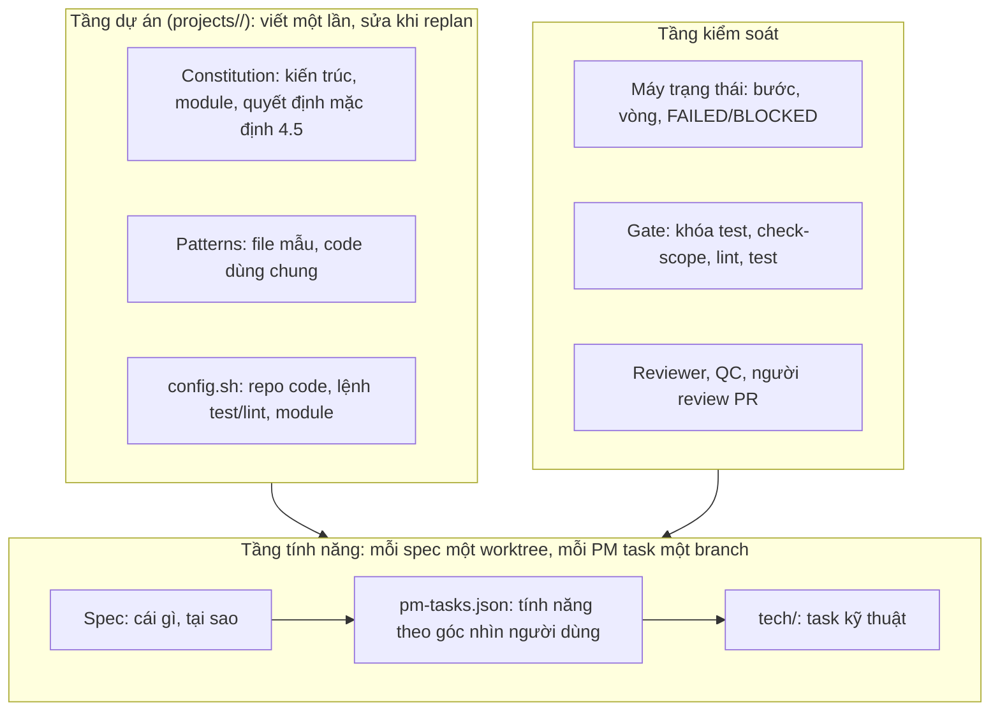
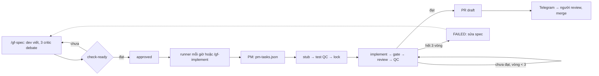

# Mô hình gf-autopilot

## Cấu trúc ba tầng

| Tầng | Vai trò |
|---|---|
| Dự án | Đặt luật chơi cho mọi tính năng của một repo code |
| Tính năng | Chuyển ý định thành code: spec → PM task → task kỹ thuật |
| Kiểm soát | Chặn thay đổi lệch khỏi spec và quy ước, bằng máy trước, người sau |

## Quy trình một tính năng

| Bước | Người quyết định | Agent/máy thực hiện |
|---|---|---|
| Spec | Phạm vi, Phụ thuộc, AC, trả lời câu hỏi 🔴 | Tra cứu, phỏng vấn, debate, `check-ready` |
| PM task | — | `gf-pm`; máy kiểm mọi AC đều có task |
| Test | — | `gf-qc` viết trước; máy kiểm "đỏ tại assertion" và khóa |
| Code | — | `gf-coder`; gate máy chặn sửa test khóa, sai phạm vi, lint/test đỏ |
| Nghiệm thu | Review PR draft, merge | `gf-reviewer`, `gf-qc`; tối đa 3 vòng |
| Replan | Cập nhật constitution 4.5, patterns | `run metrics` |

## Các lớp phòng thủ

| Lớp | Bắt lỗi |
|---|---|
| Spec + debate + `check-ready` | Sai ý định, thiếu trường hợp, thiếu tài nguyên |
| Test trước, khóa | Code chạy nhưng sai AC; test viết cho có |
| Gate máy | Sửa ngoài phạm vi, sửa test đã khóa, đường dẫn bị cấm, lint/test đỏ |
| Reviewer | Lệch pattern, viết lại thứ đã có |
| Người | Phần máy không phán được |
